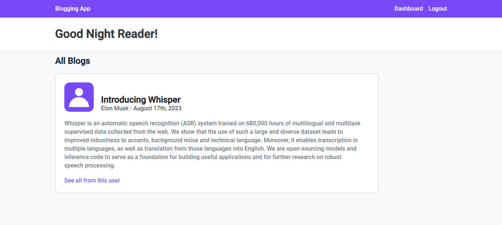

# Blogging App

A simple blogging web application that allows users to create and publish their posts. The application uses Firebase as the backend database to store user-generated content.

## Features

- **User Authentication:** Users can sign up, log in, and log out securely. Firebase Authentication is used for user management.

- **Post Creation:** Users can write and publish their blog posts. The posts are stored in Firebase Realtime Database.

- **Dashboard:** Users have a personalized dashboard where they can view their published posts.

- **Post Display:** The app displays a list of posts, including the title, author, and creation date.

- **Real-time Updates:** New posts are dynamically added to the UI in real-time without requiring a page refresh.

- **Delete Posts:** Users can delete their posts, and the changes are reflected both in the UI and the Firebase database.

## Technologies Used

- HTML, CSS, JavaScript
- Firebase (Authentication, Realtime Database)

## Contributing

Contributions are welcome! Feel free to open issues or submit pull requests.

